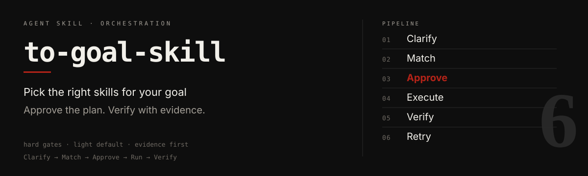
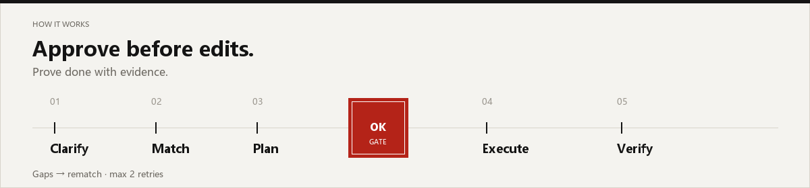

<p align="center">
  
</p>

<p align="center">
  <a href="./LICENSE"></a>
  <a href="./to-goal-skill/SKILL.md"></a>
  <a href="https://github.com/WINDGAND/to-goal-skill"></a>
</p>

<!-- README-I18N:START -->

<p align="center">
  <strong>English</strong> · <a href="./README.md">汉语</a>
</p>

<!-- README-I18N:END -->

When a task needs **more than one skill**, this agent skill clarifies what “done” means, picks a lean combo, waits for your approval, then runs and verifies with evidence.

Works with Cursor, Claude Code, Codex, Trae, WorkBuddy, and other agents that support the [Agent Skills](https://agentskills.io/) format.

## How it works

<p align="center">
  
</p>

| Step | In plain words |
|------|----------------|
| **Clarify** | Goal + checkable acceptance criteria |
| **Match** | Prefer local skills; ask before installing cloud ones |
| **Plan** | Show the orchestration card — **no business edits until approved** |
| **Run** | Invoke each chosen skill step by step |
| **Verify** | Prove every check with real evidence |
| **Retry** | Up to 2 more rounds, then stop and report gaps |

- **Use** for 2+ skill work, or when you invoke `/to-goal-skill`
- **Skip** for single-skill jobs, pure Q&A, or explicit no-plan hotfixes

> [!NOTE]
> **Light is the default** (short clarify, recipes + local match). Upgrade to full for cloud search or when you ask for full.

## Install

Requires Node.js (`npx`).

```bash
npx skills add WINDGAND/to-goal-skill@to-goal-skill -g -y
```

Install for every detected agent:

```bash
npx skills add WINDGAND/to-goal-skill@to-goal-skill -g -a '*' -y
```

> [!TIP]
> After installing, start a **new** chat so your agent can discover the skill.

## Usage

- `/to-goal-skill`
- “Use a skill combo to finish this goal”
- “Orchestrate skills for this task”

Flow: confirm goal → review plan → approve → run and verify.

## Repository layout

```text
to-goal-skill/
├── README.md / README.en.md
├── LICENSE
├── assets/readme/          ← hero / workflow visuals
└── to-goal-skill/          ← installable skill package
    ├── SKILL.md
    ├── agents/openai.yaml
    └── references/
        ├── grilling.md
        └── matching.md
```

## Acknowledgments

Clarify flow from Matt Pocock’s [grill-me](https://skills.sh/mattpocock/skills/grill-me) / grilling (MIT).  
Skill discovery adapted from [find-skills](https://skills.sh/vercel-labs/skills/find-skills).  
Plan / execute / verify adapted from obra/superpowers (`writing-plans`, `executing-plans`, `verification-before-completion`).

---

Questions: [GitHub Issues](https://github.com/WINDGAND/to-goal-skill/issues)
