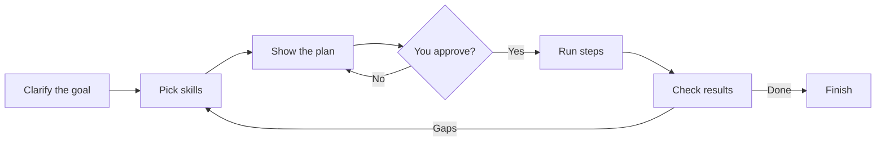

# to-goal-skill

[](./LICENSE)
[](./to-goal-skill/SKILL.md)
[](https://github.com/WINDGAND/to-goal-skill)

<!-- README-I18N:START -->

**English** | [汉语](./README.zh.md)

<!-- README-I18N:END -->

> Pick the right skills for your goal — then run them as one clear plan.

When a task needs **more than one skill**, this agent skill helps you:

1. Figure out what “done” really means  
2. Choose a small, high-quality skill combo  
3. Run the steps, check the result, and retry if needed  

Works with Cursor, Claude Code, Codex, Trae, WorkBuddy, and other agents that support the [Agent Skills](https://agentskills.io/) format.

## What it does



| Step | In plain words |
|------|----------------|
| **Clarify** | Ask sharp questions until the goal and acceptance checks are clear |
| **Match** | Prefer skills you already have; only suggest installing new ones when they are clearly better |
| **Plan** | Show goal, checks, skill list, and steps — **wait for your OK** |
| **Run** | Follow each step with the chosen skill |
| **Verify** | Prove each check with real evidence (not “should be fine”) |
| **Retry** | Up to 2 more rounds if something still fails, then stop and report gaps |

## Install

Requires Node.js (for `npx`).

```bash
npx skills add WINDGAND/to-goal-skill@to-goal-skill -g -y
```

Install for every detected agent:

```bash
npx skills add WINDGAND/to-goal-skill@to-goal-skill -g -a '*' -y
```

> [!TIP]
> After installing, start a **new** chat so your agent can discover the skill.

## Usage

In your agent, say one of:

- `/to-goal-skill`
- “Use a skill combo to finish this goal”
- “Orchestrate skills for this task”

Then follow the prompts: confirm the goal → review the plan → approve → let it run and verify.

## Repository layout

```text
to-goal-skill/                 ← this repo
├── README.md
├── README.zh.md
├── LICENSE
├── .gitignore
└── to-goal-skill/             ← the installable skill package
    ├── SKILL.md
    ├── agents/openai.yaml
    └── references/
```

## Acknowledgments

Clarify flow is derived from Matt Pocock’s [grill-me](https://skills.sh/mattpocock/skills/grill-me) / grilling (MIT).  
Skill discovery ideas adapted from [find-skills](https://skills.sh/vercel-labs/skills/find-skills).  
Plan / execute / verify ideas adapted from obra/superpowers (`writing-plans`, `executing-plans`, `verification-before-completion`).

---

Anything unclear? Open an issue on [GitHub](https://github.com/WINDGAND/to-goal-skill/issues).
