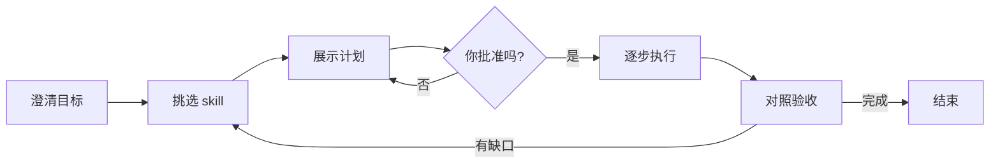

# to-goal-skill

[](./LICENSE)
[](./to-goal-skill/SKILL.md)
[](https://github.com/WINDGAND/to-goal-skill)

<!-- README-I18N:START -->

[English](./README.en.md) | **汉语**

<!-- README-I18N:END -->

> 为你的目标挑选最合适的 skill 组合，并按清晰计划执行到底。

当一件事需要 **不止一个 skill** 时，这个 Agent Skill 会帮你：

1. 先把「什么叫完成」说清楚  
2. 选出一套精简、靠谱的 skill 组合  
3. 按步骤执行、验收，不够好再重试  

兼容 Cursor、Claude Code、Codex、Trae、WorkBuddy 等支持 [Agent Skills](https://agentskills.io/) 格式的工具。

## 它做什么



| 步骤 | 一句话说明 |
|------|------------|
| **澄清** | 把目标问清楚，并写出可检查的验收标准 |
| **匹配** | 优先用本地已有 skill；只有云端明显更好时才问你要不要安装 |
| **计划** | 展示目标、验收、skill 列表和步骤 — **等你点头再动手** |
| **执行** | 按步骤调用对应 skill |
| **验收** | 用真实证据对照每一条验收标准（不能只靠感觉） |
| **重试** | 最多再试 2 轮；仍不行就停下来汇报缺口 |

### 什么时候用 / 不用

- **适合**：需要 2 个以上 skill 协作，或你明确调用 `/to-goal-skill`
- **不适合**：单个 skill 就能做完、纯问答、或你明确要求跳过计划直接热修

默认走 **light**（少问、配方+本地匹配）；只有你要云端搜索、验收项较多或明确说 full 时才升全量。  
简单问答 / 单 skill / 热修：应直接拒绝编排，不进完整流程。

可选：在 Cursor 里安装 [integrations/cursor](./integrations/cursor/README.md) hooks，未批准编排卡前硬拦业务改文件与 `npx skills add`。

## 安装

需要 Node.js（用于 `npx`）。

```bash
npx skills add WINDGAND/to-goal-skill@to-goal-skill -g -y
```

安装到本机检测到的全部 Agent：

```bash
npx skills add WINDGAND/to-goal-skill@to-goal-skill -g -a '*' -y
```

> [!TIP]
> 安装后请 **新开一轮对话**，方便 Agent 重新发现该 skill。

## 使用方式

在 Agent 里可以说：

- `/to-goal-skill`
- 「用多个 skill 组合完成这个目标」
- 「帮我编排 skill 来做这件事」

然后按提示走：确认目标 → 看计划 → 批准 → 执行与验收。

## 仓库结构

```text
to-goal-skill/                 ← 本仓库
├── README.md                  ← 默认中文
├── README.en.md               ← English
├── LICENSE
├── .gitignore
├── integrations/cursor/       ← 可选：Cursor 硬拦 hooks
└── to-goal-skill/             ← 可安装的 skill 包
    ├── SKILL.md
    ├── agents/openai.yaml
    └── references/
        ├── grilling.md
        ├── matching.md
        ├── recipes.md         ← 高频配方
        └── pressure-evals.md
```

## 致谢

澄清流程源自 Matt Pocock 的 [grill-me](https://skills.sh/mattpocock/skills/grill-me) / grilling（MIT）。  
Skill 发现思路参考 [find-skills](https://skills.sh/vercel-labs/skills/find-skills)。  
计划 / 执行 / 验收思路参考 obra/superpowers（`writing-plans`、`executing-plans`、`verification-before-completion`）。

---

还有不清楚的地方？欢迎在 [GitHub Issues](https://github.com/WINDGAND/to-goal-skill/issues) 提问。
