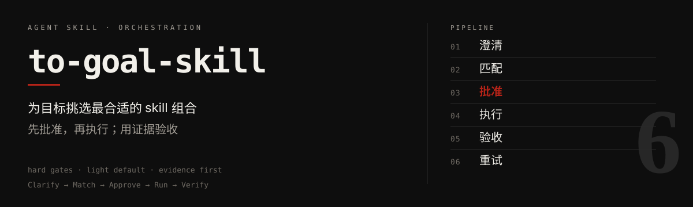
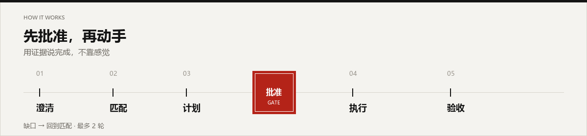

<p align="center">
  
</p>

<p align="center">
  <a href="./LICENSE"></a>
  <a href="./to-goal-skill/SKILL.md"></a>
  <a href="https://github.com/WINDGAND/to-goal-skill"></a>
</p>

<!-- README-I18N:START -->

<p align="center">
  <a href="./README.en.md">English</a> · <strong>汉语</strong>
</p>

<!-- README-I18N:END -->

当一件事需要 **不止一个 skill** 时，这个 Agent Skill 帮你把「完成」说清楚，挑一套精简组合，批准后再执行，并用证据验收。

兼容 Cursor、Claude Code、Codex、Trae、WorkBuddy 等支持 [Agent Skills](https://agentskills.io/) 格式的工具。

## 它怎么工作

<p align="center">
  
</p>

| 步骤 | 说明 |
|------|------|
| **澄清** | 目标 + 可检查的验收标准 |
| **匹配** | 优先本地 skill；云端明显更好时再询问安装 |
| **计划** | 展示编排卡片，**批准前不改业务文件** |
| **执行** | 按步骤调用对应 skill |
| **验收** | 用真实证据对照每一条标准 |
| **重试** | 最多再试 2 轮，仍不行则停下汇报缺口 |

- **适合**：2+ skill 协作，或明确调用 `/to-goal-skill`
- **不适合**：单 skill 可完成、纯问答、要求跳过计划的热修

> [!NOTE]
> 默认 **light**（少问、配方 + 本地匹配）。需要云端搜索或你指定 full 时再升全量。

## 安装

需要 Node.js（`npx`）。

```bash
npx skills add WINDGAND/to-goal-skill@to-goal-skill -g -y
```

安装到本机检测到的全部 Agent：

```bash
npx skills add WINDGAND/to-goal-skill@to-goal-skill -g -a '*' -y
```

> [!TIP]
> 安装后请 **新开一轮对话**，方便 Agent 重新发现该 skill。

## 使用方式

- `/to-goal-skill`
- 「用多个 skill 组合完成这个目标」
- 「帮我编排 skill 来做这件事」

流程：确认目标 → 看计划 → 批准 → 执行与验收。

## 仓库结构

```text
to-goal-skill/
├── README.md / README.en.md
├── LICENSE
├── assets/readme/          ← hero / workflow 视觉
└── to-goal-skill/          ← 可安装 skill 包
    ├── SKILL.md
    ├── agents/openai.yaml
    └── references/
        ├── grilling.md
        └── matching.md
```

## 致谢

澄清流程源自 Matt Pocock 的 [grill-me](https://skills.sh/mattpocock/skills/grill-me) / grilling（MIT）。  
Skill 发现参考 [find-skills](https://skills.sh/vercel-labs/skills/find-skills)。  
计划 / 执行 / 验收参考 obra/superpowers（`writing-plans`、`executing-plans`、`verification-before-completion`）。

---

问题反馈：[GitHub Issues](https://github.com/WINDGAND/to-goal-skill/issues)
